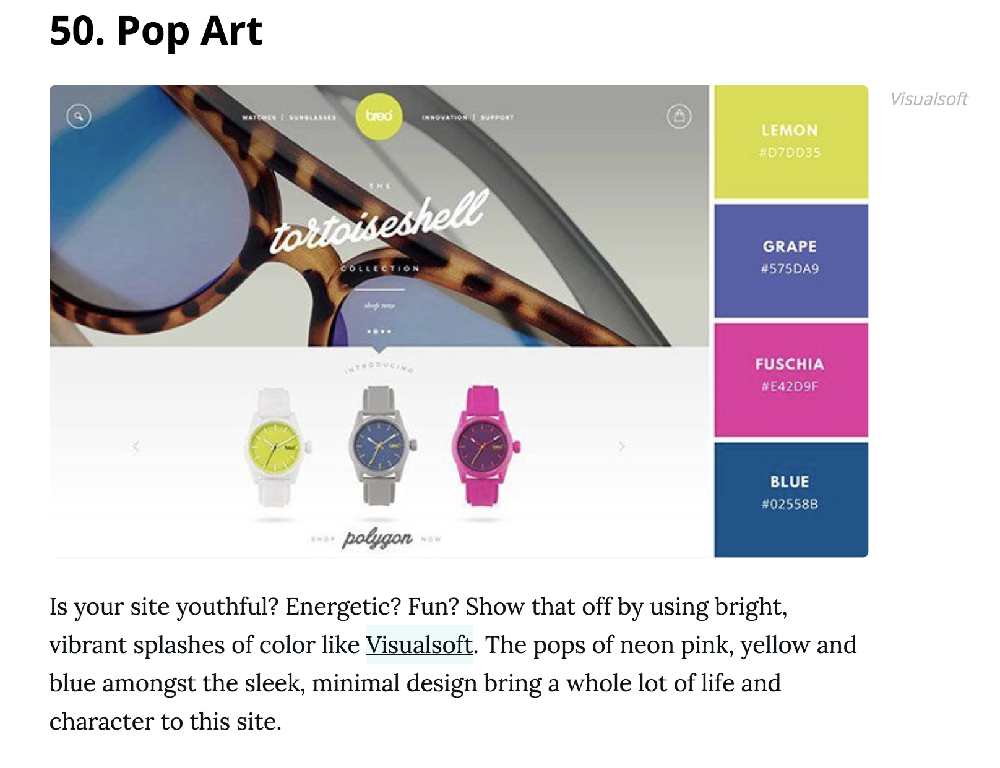
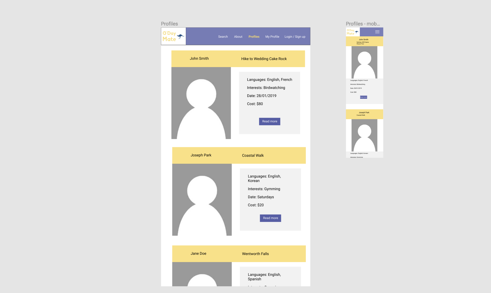

# **Rails App Documentation**

## **Brainstorming**
Researching popular business ideas online, understanding trending 2-sided marketplaces
Ideas:
- language exchange
- Cultural exchange dates (tinder meets culture exchange)
- G’day mate (travel guide with locals) 
- Petsitter (airbnb for pets) 

### **Decision** 
Settle for g’day mate inspired by https://www.ohmyoppa.com/
A site where you rent an ‘oppa’ (male guide) targeted to travellers particularly female travellers who wish for a male guide to show them around korea( seoul) 

## **App Idea** - G’day Mate (name still in the works)

**Problem:** Travellers, mostly young solo travellers in particular are faced with a problem of travelling to new countries without having any networks or connections to locals in that country to show them around, they are left with an option of either group tours or solo adventures, group tours keep you in a bubble without the chance of connecting with locals, where as solo travelling leave you exposed and vulnerable to scams along with time consuming research which may lead to destinations/restaurant choices that may end up being a letdown.

**Solution:** g’day mate / fellow wanderer 
An app/website which will allow users who sign up to interact with other ‘mates’/‘wanderers’, with the target of connecting users to become friends/ allow foreign users to connect Sydney locals.   Local users will have the ability to post their profiles promoting their private tours and a brief overview of their itinerary, along with targeted destination they will take you to, hidden gems that normal group tours do not show you.

The app is aimed at young travellers who seek a travel companion in Australia. This travel platform allows users to be either a buyer or seller. 
Users that are sellers will mostly be locals who have lived in the area long enough to have acquired knowledge of great spots which can be introduced to young travellers who seek a ‘friend-like’ guide/‘mate’. 

The targeted area will be Sydney Australia for now. The guides/advertising ‘mate’ will have a planned out course/itinerary 

Sellers will list: 
- Language skills
- Day Availability (either by date or days of the week)
- Interests
- additional expenses required will be listed among activities
- base price of tour
- Time length of tour
- travel method (private car or public transport) 
- target destination
			

Features: 
- reviews/comments (if able to, only from users who have purchased/dont knhow to do this)
- profile of guide listing: interests,
- messenger platform

Buyers can:	
- browse profiles
- purchase/book dates
- search with tags, language skills, destination

## **User Stories**

can be viewed more thoroughly here: https://trello.com/b/9gr1ZZWF/gday-mate-user-stories

### **Detailed User Stories**

*Users should be able to edit their profile*

Feature: edit profile

- users sign up and log in
- users post their profile
- Users can edit their profile and bio
- To update details

Scenario: Users edit profile

- given I’m a logged in user
- When I visit my edit profile page
- I should be able to update details from photos posted or information on price
- Click update
- Should be able to see my updated profile page

 

*Users should not be able to edit other profile pages other then their own*

Feature: unable to edit other pages
- as a user I don’t want the option for edit to be available for my profile
- Because I want to have control over why account

Scenario:  user attempts to edit another users profile
- given I’m a logged in user
- When I browse the profiles
- The option for editing another profile should not appear

 

*Users and visitors should be able to browse profiles*

feature: browsing
- as a visitor or user 
- I should be able to search
- And browse through the multiple profiles listed

scenario: user or visitor browses profiles
- as a visitor or user
- Landing on the homepage
- I should be able to direct to profile listings
- And see the information posted such as photos and costs

 

*Users should be able to delete their profiles*

Feature: delete posted profiles
- as a logged in user
- I should be able to delete my posted profile only

Scenario: user delete own profile
- given I’m a logged in user the option for profile deletion should only be available to me
- The user that originally posted the profile
- And I should not be able to see this option on the profiles which I browse

 

*User should not be able to view New profile form page without logging in*

Feature: User must be logged in to see the add new profile form
- As site Admin
- I want users to be required to log in in order to add a book listing
- Because I want to encourage users to create an account on the site

Scenario: User visits add new profile page
- Given I'm a logged out user
- When I go to the add new profile page
- Then I am redirected to the login page

 

*When logged in, user should not be able to view any page other than 'create profile' until they have created a profile* 

Feature: User must create a profile upon signup in order to interact on the site
- As site Admin
- I want all users to be required to have a profile
- Because it builds a sense of community

Scenario: User without a profile attempts to visit any page
- Given I'm a logged in user
- And I don't have a profile
- When I go to any page other than the create profile page
- Then I am redirected to the create profile page

 

## **Design Decisions**

### **colour scheme**

http://blog.visme.co/website-color-schemes/

Visiting websites for information. Research current colour schemes

Travel website colour scheme/palette patterns 
https://www.canva.com/learn/website-color-schemes/

Keep it simple stupid!

https://designwebkit.com/web-design/how-to-design-website-color-scheme/

http://rudecolor.com/color-design-for-a-travel-website/

 

 

A choice of either 2 of these schemes. One is simple while the other is aimed for a youthful audience which is the intended targeted audience. I have.chosen ‘pop art’ for it’s edgy feel and think it would go along well with a mostly white background. Using these colours for minor details such as buttons, menu bar, and borders.

### **Font style**

Researched into popular font of 2017 and 2018 along with fonts used in travel websites.

https://www.websitebuilderexpert.com/pick-best-font-style-for-website/

https://blog.logodesignguru.com/travel-agency-fonts-local-marketing-2/

from the website above: 
> Looking for something crisp and modern? Use 'Sans serif' fonts which don’t have that line at the end of each stroke.

https://www.creativebloq.com/typography/free-web-fonts-1131610

The website listed above contained a list of fonts with examples, following the trend on modern popular fonts, the fonts I have narrowed down to are as listed:

- Fira Sans
- Montserrat
- Josefin Sans
- Palanquin
- Sans serif

I have decided to go with palanquin, josefin sans and sans serif as the final default in that order, the reason for this decision is the modern feel and popularity of these fonts in recent years. 

## **Flowchart**

This is the first proposed flowchart diagram. Starting from the home page, you can navigate towards these other options/pages. Certain pages will have limits for users that are not logged in or do not own certain posts, in this case tour profiles.

## **Wireframes**

These are the initial wireframes for the product. They can be viewed more thoroughly here: https://www.figma.com/file/WzUd79CMSVaSv11q3FDWwZng/G'Day-Mate

## **ERD**

This is the ERD of the MVP of the website which can be viewed more thoroughly here:
https://www.dbdesigner.net/designer/schema/168716

## **Trello**

the trello board can be viewed more thoroughly here: https://trello.com/b/ZC448ACo/gday-mate

here is the screenshot of the inital board:

